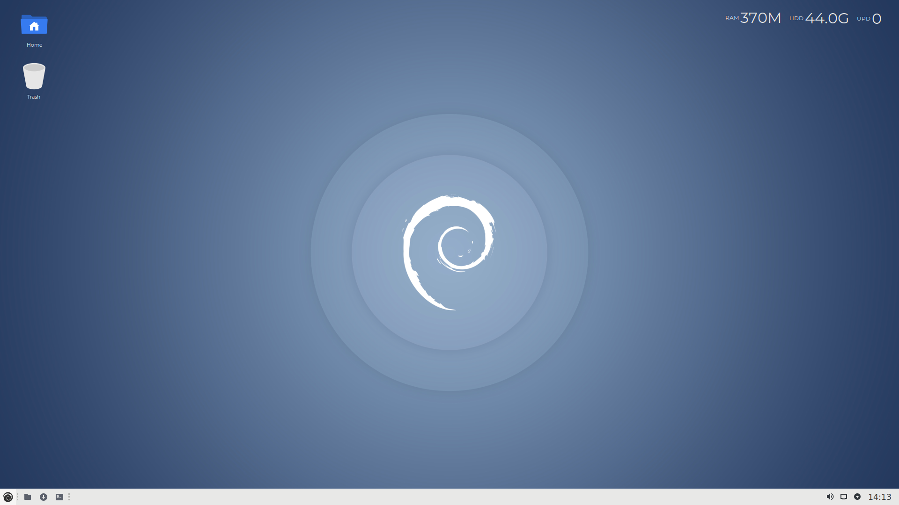

# DX10
Pure Debian built from netboot with only the required packages to run XFCE efficiently, nothing else. This leaves room for your demanding apps and work process. Designed to stay out of your way and let you get things done.

Features a host of under-the-hood improvements making your system snappy even on low-end hardware (1GB min - 4GB recommended). Theming is deliberately plain as most will change it anyway. Only basic software is included, the rest is up to you. A concept 3 years in the making which has been tested, refined and used as a daily driver. Has not been tested in a printing/networking environment (testers welcome).

CREDITS

Base: Debian Buster

Desktop: XFCE

Desktop wallpaper: Droplets by Philip Haas

Theming: Materia GTK & Flat Remix

Build: Jason Dessington
